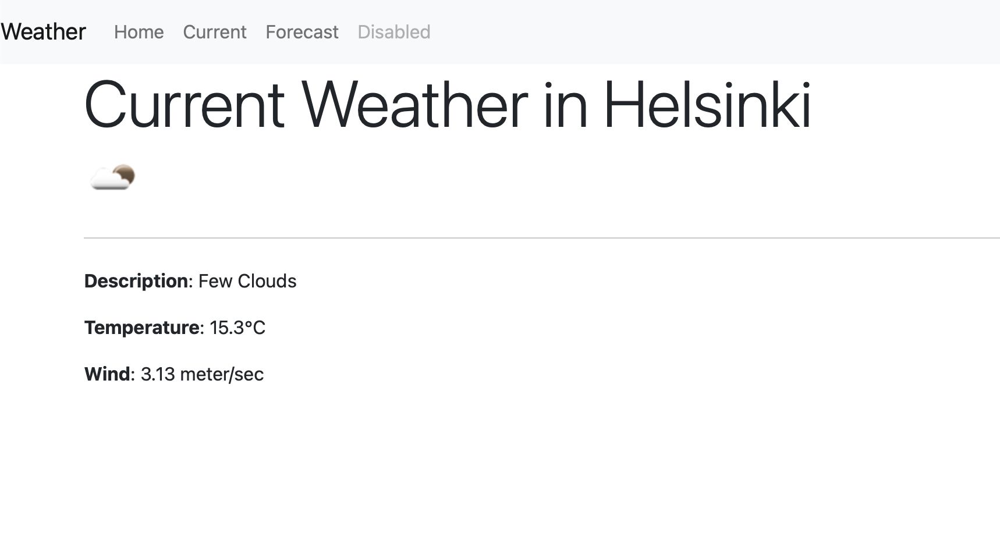

# :snowman_with_snow: Weather Application - Helsinki Weather

The web application designed to provide real-time weather updates for Helsinki, Finland. Whether you're a resident or a visitor, staying informed about the weather has never been easier, ensuring that you can make informed decisions about your day.

Plan your day confidently with accurate forecasts and trends, making sure you're prepared for whatever the Helsinki weather has in store.

For Back-end, Python backend communicating with OpenWeather API.
HTML + Javascript frontend website.
Test deployed to Heroku using Docker and GitHub actions.

## :star2: Keys Features
Stay prepared and in the know with our weather application, designed to enhance your daily routines and plans in Helsinki.
- Real-Time Updates
- Comprehensive Data
- Accurate Forecasts
- Reliable Data Sources

## :round_pushpin: Main Task Lists For Application Development

- [x] Create flask server with outbound api calls to obtain weather information
- [x] Add frontend static content to display weather
- [x] Create Docker container
- [x] Deploy app to Heroku
- [x] Continuous deployments with GitHub actions

## :camera_flash: Technology Used:

- [x] Back-end Development: Python, Flask, Jinja
- [x] Front-end Development: HTML, Javascript, Bootstrap styling
- [x] Database: OpenWeather API
- [x] Deployment/Server: Heroku
- [x] CI/CD Setup: GitHub actions
- [x] Container: Docker
- [x] Set Up Virtual environment
- [x] Set Up Environment Variables to hide sensitive information
- [x] Coding and research skills

## :iphone: Screenshots

|                                         |
| --------------------------------------- |
|  |
|  |


## :gem: Helpful Commands

### :floppy_disk: Commands for installing local environment
```Python
python3 -m venv env
```
```Python
source ENV/bin/activate
```
```Python
pip install flask requests python-dotenv
```
```Python
pip list
```
```Python
export FLASK_ENV=development
```
### :desktop_computer: The required command for installing dependencies in terminal
```Python
flask run
```

### :hammer_and_wrench: Building Container for Deployment
```Python
pip freeze > requirements.txt
```
```Python
docker build . -t app
```
```Python
docker image ls
```
```Python
docker run -p 5000:5000 --env-file .env app
```

### :tv: Heroku commands for deployment:
```Python
heroku login
```
- [x] To connect git repository with heroku app git
```Python
heroku git:remote -a weatherapp-helsinki
```
```Python
git add .
```
```Python
git commit -m "added heroku.yml file"
```
```Python
heroku create weatherapp-helsinki //if name is taken, choose another
```
- [x] To set environment variables
```Python
heroku config:set BASE_URL=https://api.openweathermap.org/data/2.5 --app weatherapp-helsinki
```
```Python
heroku stack:set container --app weatherapp-helsinki
```
- [x] To Manual push to heroku - not required as we use GitHub actions, after committing your changes to git
```Python
git push heroku master
```
- [x] To 'force' push code to heroku when the main code is not at git master/main
```Python
git push --force heroku develop:master
```
- [x] To push code to heroku from a git branch without force
```Python
git push heroku develop:main
```
